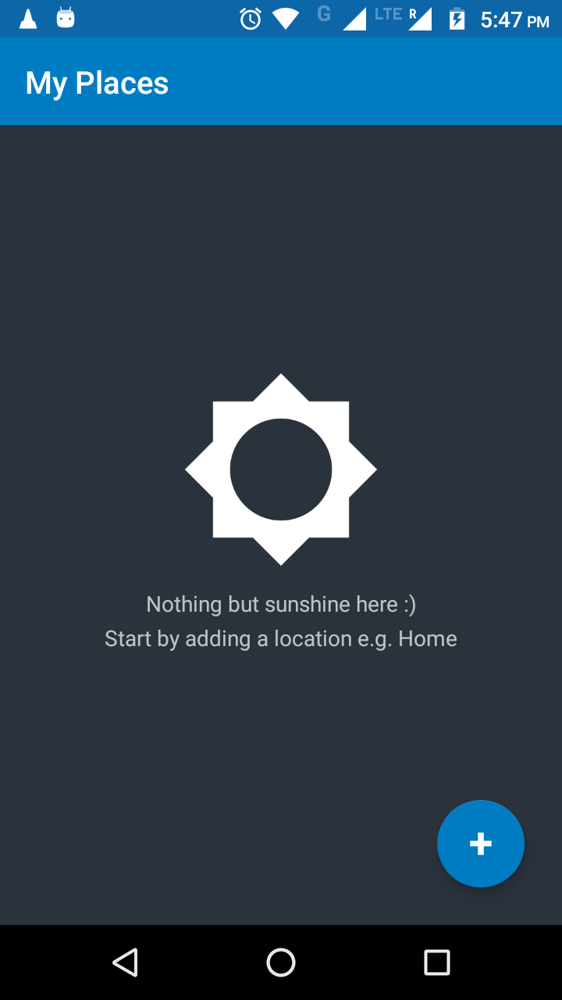

### [_My Places_ android app](https://github.com/abhishekBansal/My-Places)

Save, View, Navigate to and Share your places in a quickest possible way

This is the official source code repository for the [_My Places_]((https://play.google.com/store/apps/details?id=rrapps.myplaces)) android app.

#### Screenshots

#### Notes

* minimum supported version of Android:
  * Android 4.1 (API level 16)

#### Legal

* copyright: [Abhishek Bansal](https://github.com/abhishekBansal)
